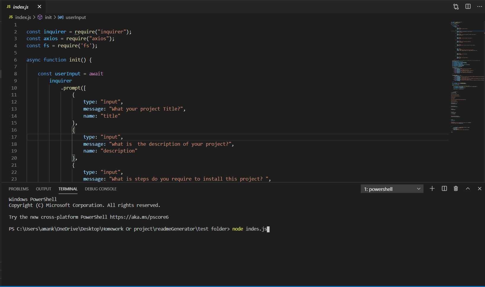
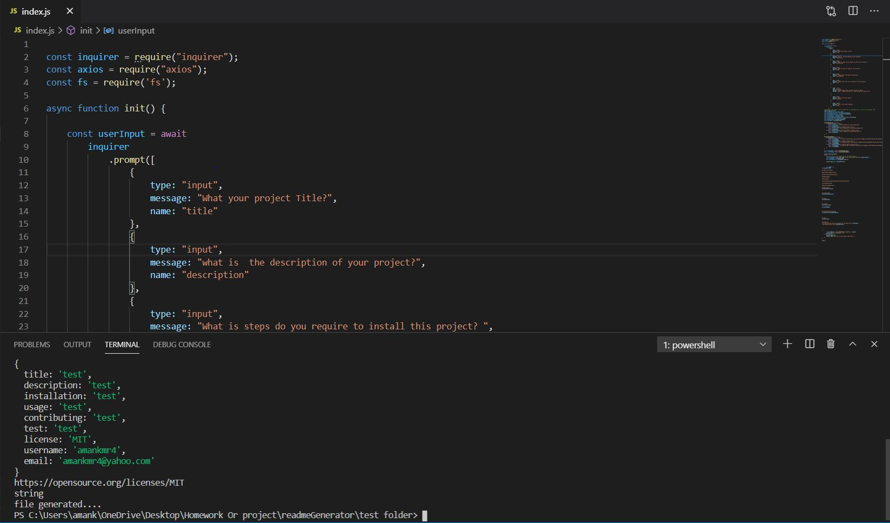
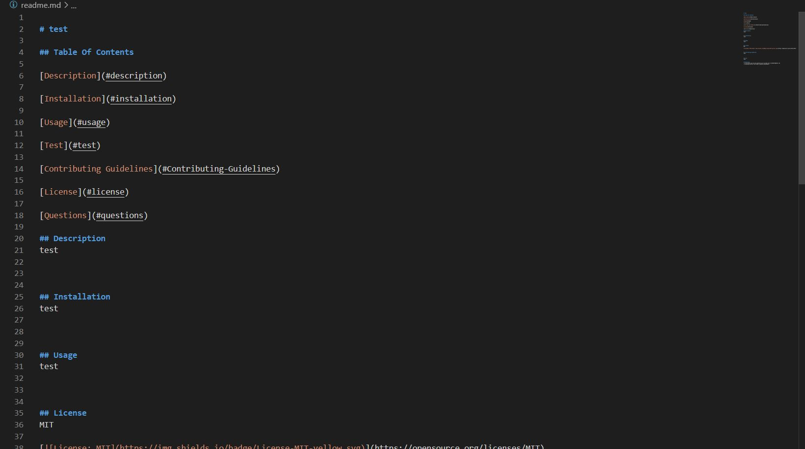
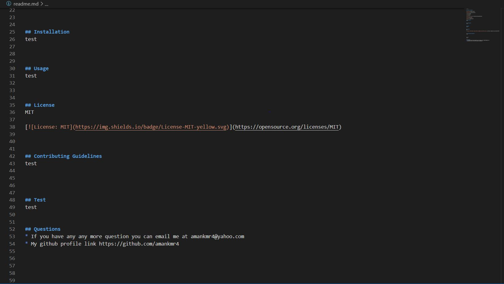

# ReadMe-Generator
I have created a command line prompt which uses javascript and implementation of Node.js to create a markdown file. This file with the use of the answers from the prompt will assist you in creating a readme file.

[User Story](#User-Story)

[Installation](#installation)

[Project Screenshots](#Project-Screenshots)

[License](#license)

## User Story
As a developer,
I wanted to created a javasctip prompt that will assist me in creating a readme file. 
So, that I have a more time to focuse on the project

## Installation

1. npm init 
2. npm install axios 
3. npm install inquirer

## Project Screenshot

## License

You can refer to the licenses used in this project in the license.md file

### Author

Aman Kumar

Email: aman.kmr4@yahoo.com
